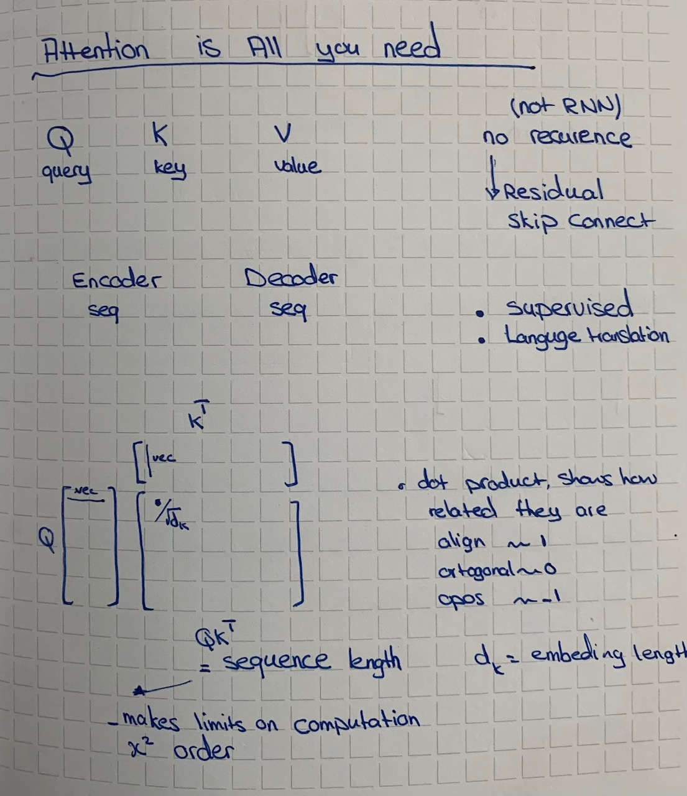
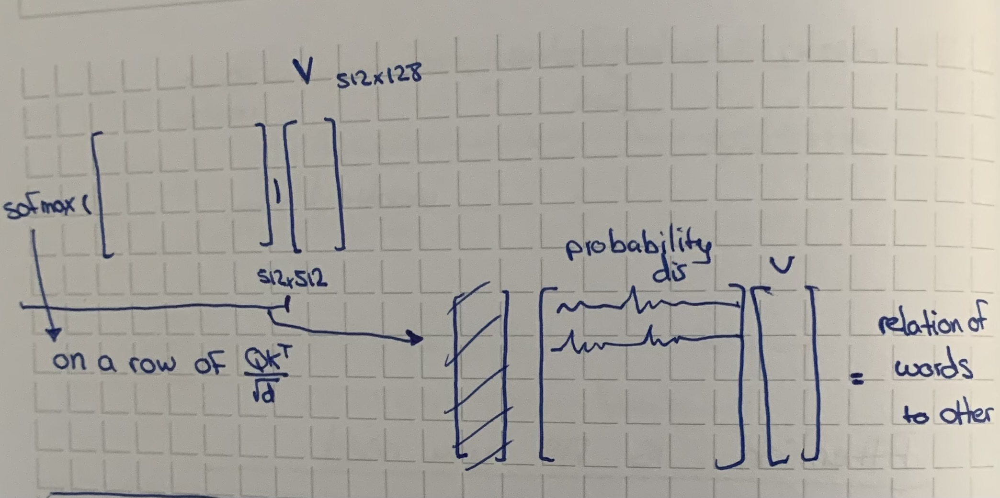
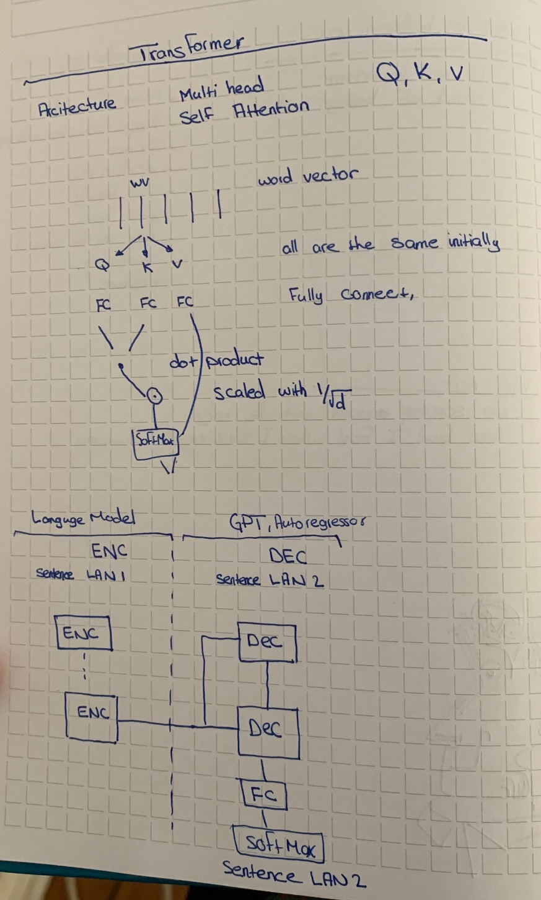
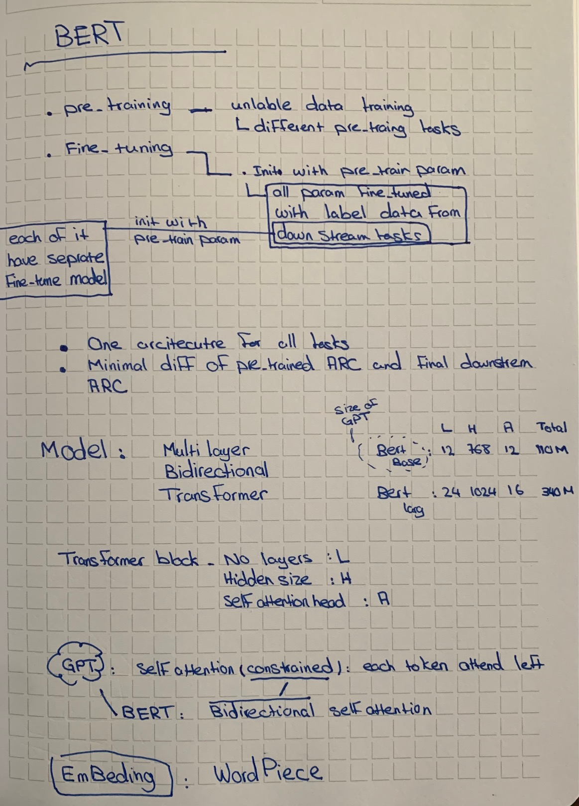
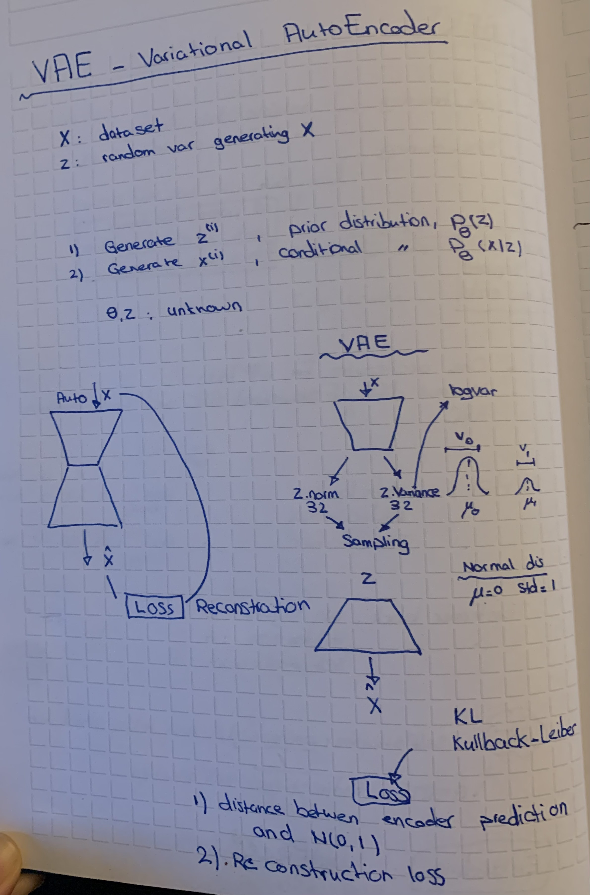

# dsr-nlp

## Dependencies
```
python 3.8.6
python -m venv ./envs
```

## Overview

- Regression:
  - Metrics: mean error
  - Loss: RMSE
- Classification
  - Loss: cross entropy categorical sparse/ negative likelihood loss, for binary (sigmoid).


- What happens with only 2 layers NN? NN is learning the function, if it has only two layers, no hidden layer, then it can't learn the function (XOR example).

- More layers vs more nodes, more layers perform better, no mathematical proof so far just observation.
- NN, is a directed, weighted a-cyclic graph.

## Solve overfit
- add more data
- fewer layers
- regularization
- Drop out 


## LSTM


# Natural Language Prossesing


## Use cases
- Text Generation, Auto Regressor
- Sentiment analysis, e.g. review classification
- Machine Translation
- Intent, keyword extraction
- NER, named entity recognition
- part of speech tagging, still text
- Summary
- conversational Agent-chat bot
- language modeling, text to vector/tensor (embedding)


# Architecture
## Transformer 
- autosuppervise, the sequence of text 
### Classes
- T5 transformer, sequence to sequence (SEQ2SEQ), encoder-decoder
- GPT like, decoder only
- BERT like, encoder only

## other
- LSTM
- RWVK*
- Embedding 

### LANG CHAIN
- LLM
- VECTOR database
- not searching with elastic search


### Good links
- LSTM effective, [link](https://karpathy.github.io/2015/05/21/rnn-effectiveness/)
- [gpt-engineer](https://github.com/AntonOsika/gpt-engineer/tree/main)
- [haging phase](https://huggingface.co/spaces/JammyMachina/the-jam-machine-app)


### Transformer






### Bert



### VAE

